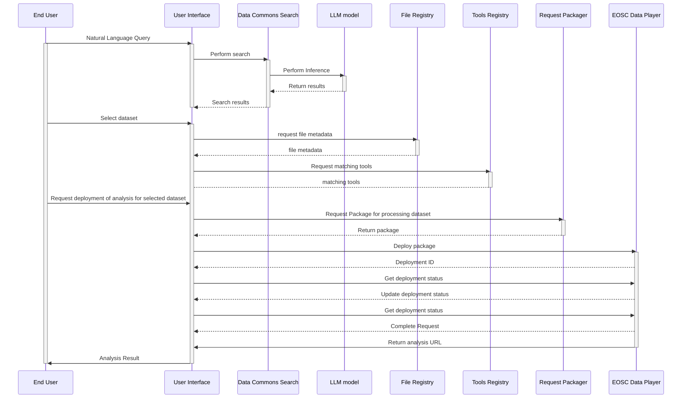
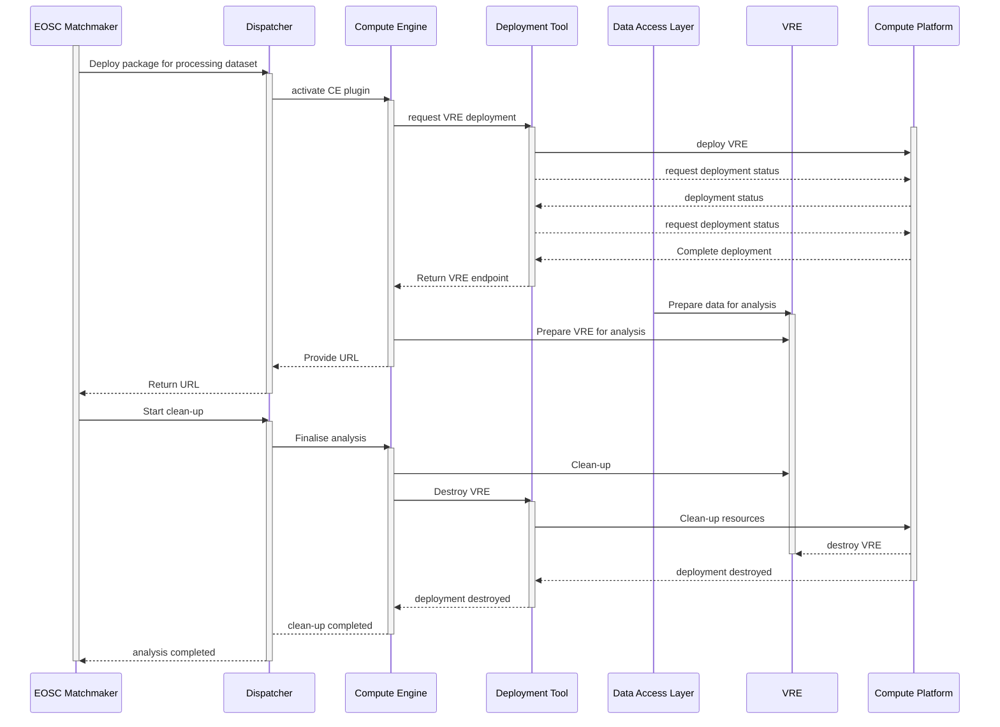

# architecture

EOSC Data Commons Architecture diagrams and additional documentation

## Runtime views

### EOSC Matchmaker

```mermaid
sequenceDiagram
  participant EU as End User
  participant UI as User Interface
  participant DCSearch as Data Commons Search
  participant LLM as LLM model
  participant FR as File Registry
  participant TR as Tools Registry
  participant Packager as Request Packager
  participant Player as EOSC Data Player

  EU ->> UI: Natural Language Query
  activate EU
  activate UI
  UI ->> DCSearch: Perform search
  activate DCSearch
  DCSearch ->> LLM: Perform Inference
  activate LLM
  LLM -->> DCSearch: Return results
  deactivate LLM
  DCSearch -->> UI: Search results
  deactivate DCSearch
  deactivate UI

  EU ->> UI: Select dataset
  activate UI
  UI ->> FR: request file metadata
  activate FR
  FR -->> UI: file metadata
  deactivate FR
  UI ->> TR: Request matching tools
  activate TR
  TR --> UI: matching tools
  deactivate TR
  EU ->> UI: Request deployment of analysis for selected dataset
  UI ->> Packager: Request Package for processing dataset
  activate Packager
  Packager -->> UI: Return package
  deactivate Packager
  UI ->> Player: Deploy package
  activate Player
  Player -->> UI: Deployment ID
  UI->>Player: Get deployment status
  Player -->> UI: Update deployment status
  UI->>Player: Get deployment status
  Player -->> UI: Complete Request
  Player ->> UI: Return analysis URL
  deactivate Player
  UI->> EU: Analysis Result
  deactivate UI

  deactivate EU
```

### EOSC Data Player

```mermaid
sequenceDiagram
  participant EM as EOSC Matchmaker
  participant Dispatcher as Dispatcher
  participant CE as Compute Engine
  participant DT as Deployment Tool
  participant Data as Data Access Layer
  Participant VRE as VRE
  Participant Compute as Compute Platform

  activate EM
  EM ->> Dispatcher: Deploy package for processing dataset
  activate Dispatcher
  Dispatcher ->> CE: activate CE plugin
  activate CE
  CE ->> DT: request VRE deployment
  activate DT
  activate Compute
  DT ->> Compute: deploy VRE
  DT -->> Compute: request deployment status
  Compute -->> DT: deployment status
  DT -->> Compute: request deployment status
  Compute -->> DT: Complete deployment
  DT -->> CE: Return VRE endpoint
  deactivate DT
  Data ->> VRE: Prepare data for analysis
  activate VRE
  CE ->> VRE: Prepare VRE for analysis
  CE -->> Dispatcher: Provide URL
  deactivate CE
  Dispatcher -->> EM: Return URL
  deactivate Dispatcher

  EM ->> Dispatcher: Start clean-up
  activate Dispatcher
  Dispatcher ->> CE: Finalise analysis
  activate CE
  CE ->> VRE: Clean-up
  CE ->> DT: Destroy VRE
  activate DT

  DT ->> Compute: Clean-up resources
  Compute -->> VRE: destroy VRE
  deactivate VRE
  Compute-->>DT: deployment destroyed
  deactivate Compute

  DT-->>CE: deployment destroyed

  deactivate DT

  CE-->Dispatcher: clean-up completed
  deactivate CE
  Dispatcher-->>EM: analysis completed
  deactivate Dispatcher
  deactivate EM
```
