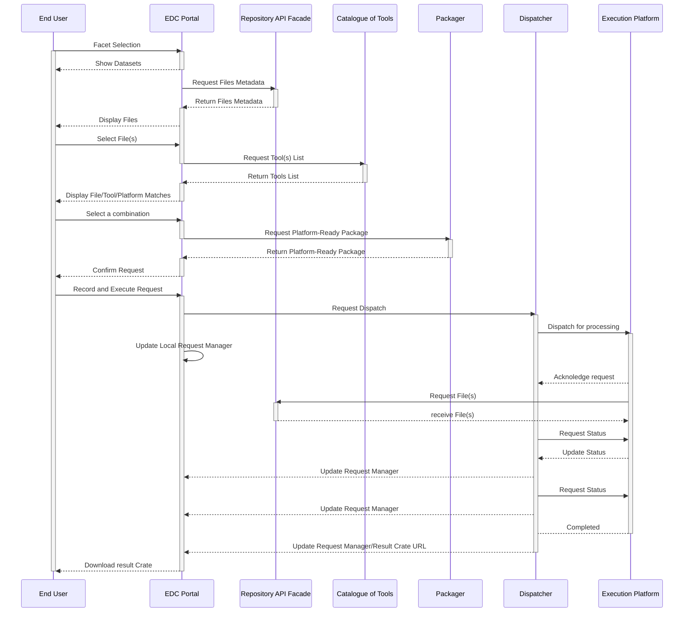

# Flow chart for WP05

```mermaid
sequenceDiagram
  participant EU as End User
  participant EDCPortal as EDC Portal
  participant RepoAPI as Repository API Facade
  participant Catalogue as Catalogue of Tools
  participant Packager as Packager
  participant Dispatcher as Dispatcher
  participant EP as Execution Platform
  EU ->> EDCPortal: Facet Selection
  activate EU
  activate EDCPortal
  EDCPortal -->> EU: Show Datasets
  deactivate EDCPortal
  EDCPortal ->> RepoAPI:Request Files Metadata
  activate RepoAPI
  RepoAPI -->> EDCPortal:Return Files Metadata
  deactivate RepoAPI
  activate EDCPortal
  EDCPortal -->> EU:Display Files
  EU ->> EDCPortal: Select File(s)
  EDCPortal ->> Catalogue: Request Tool(s) List
  deactivate EDCPortal
  activate Catalogue
  Catalogue-->>EDCPortal: Return Tools List
  deactivate Catalogue
  activate EDCPortal
  EDCPortal-->>EU: Display File/Tool/Platform Matches
  deactivate EDCPortal
  EU->>EDCPortal: Select a combination
  activate EDCPortal
  EDCPortal->>Packager: Request Platform-Ready Package
  deactivate EDCPortal
  activate Packager
  Packager-->>EDCPortal: Return Platform-Ready Package
  deactivate Packager
  activate EDCPortal
  EDCPortal-->>EU: Confirm Request
  deactivate EDCPortal
  EU->>EDCPortal: Record and Execute Request
  activate EDCPortal
  EDCPortal->>Dispatcher: Request Dispatch
  activate Dispatcher
  Dispatcher->>EP: Dispatch for processing
  activate EP
  EDCPortal->>EDCPortal: Update Local Request Manager
  EP-->>Dispatcher: Acknoledge request
  EP->>RepoAPI: Request File(s)
  activate RepoAPI
  RepoAPI-->>EP: receive File(s)
  deactivate RepoAPI
  Dispatcher->>EP:Request Status
  EP-->>Dispatcher: Update Status
  Dispatcher-->>EDCPortal: Update Request Manager
  Dispatcher->>EP:Request Status
  Dispatcher-->>EDCPortal: Update Request Manager
  EP-->Dispatcher:Completed
  deactivate EP
  Dispatcher-->>EDCPortal: Update Request Manager/Result Crate URL
  deactivate Dispatcher
  EDCPortal-->>EU: Download result Crate
  deactivate EDCPortal
  deactivate EU
```
